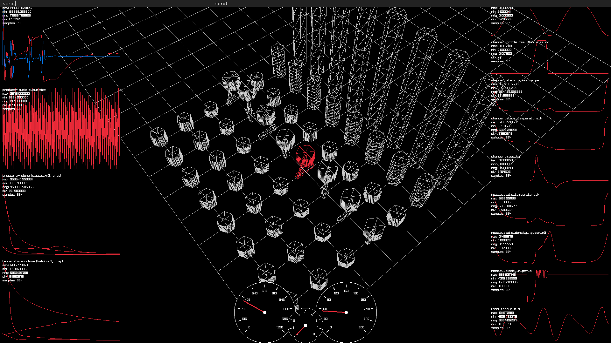

## ENSIM5

[https://www.youtube.com/watch?v=za0bQ6HqPRg](https://www.youtube.com/watch?v=za0bQ6HqPRg)

Ensim5 improves on Ensim4 by exploring SIMD and cache locality for piston kinematics, isentropic flow, and computational fluid dynamics.

## Controls

1,2,3,4: Throttle
0: Disables ignition
Q,E: Camera pan
W,A,S,D: Chamber select
<,>: Gear decrement/increment

### ATTRIBUTION

Ange Yaghi for the inspiration.
