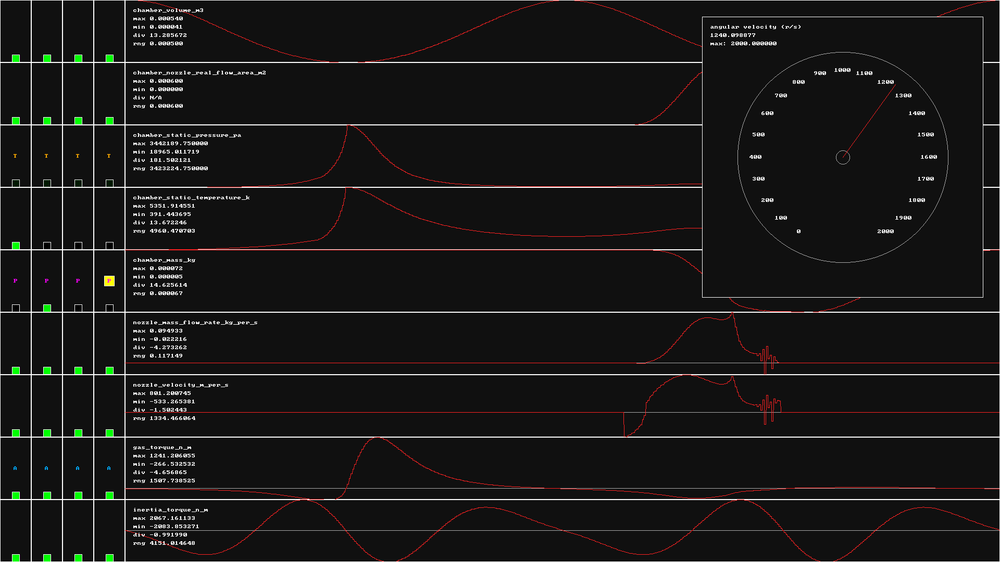

## ENSIM5

1,2,3,4 for throttle control.

Q,E to cycle popups.

[https://www.youtube.com/watch?v=za0bQ6HqPRg](https://www.youtube.com/watch?v=za0bQ6HqPRg)

Ensim5 improves on Ensim4 by exploring SIMD and cache locality for piston kinematics, isentropic flow, and computatoinal fluid dynamics.

### ATTRIBUTION

Ange Yaghi for the inspiration.
